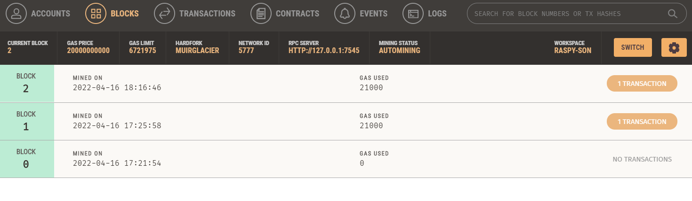
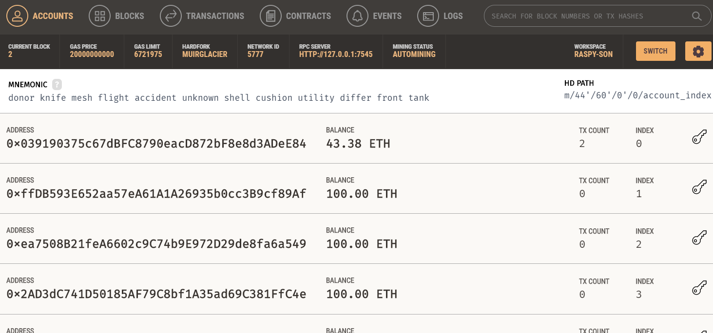
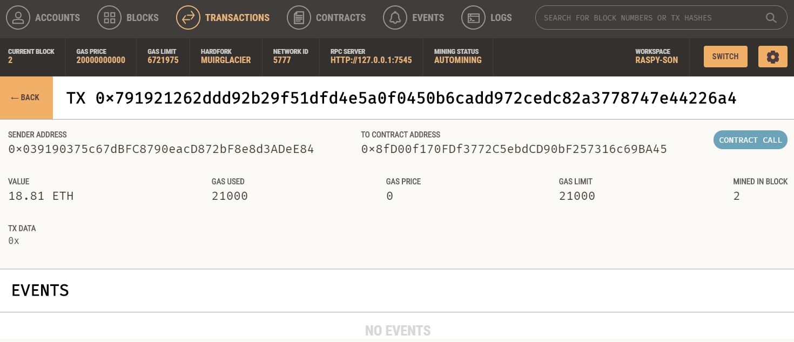
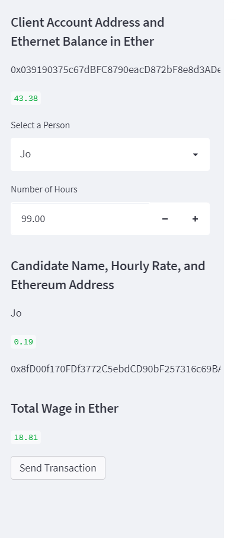

# Ethereum_TX_via_Ganache

This Python application is meant to demonstrate how a transaction over an Ethereum blockchain can be automated, and the possible use of the automation by simulating a service in which freelance FinTech professionals can be directly paid in Ethereum, with the wage being based on hours they'll be hired for and their own personal rate.
In the application, the customer can choose which FinTech professional they would like to hire, as well as how long they want to hire them. The total Ethereum that they'll be paid ends up getting sent directly to their wallet.

---

## Technologies

### Libraries:
* os
* requests
* load_dotenv from dotenv
* Wallet from bip44
* Web3 from web3
* Account from web3
* middleware from web3
* medium_gas_price_strategy from web3.gas_strategies.time_based
* Any and List from typing
* dataclass from dataclasses
* Streamlit

The language of this application is Python on the Anaconda developement environment, used in Visual Studio Code. The libraries used that come with Anaconda Python are all listed besides requests, bip44, dotenv, Web3, and Streamlit. To use requests, bip44, dotenv, Web3, and Streamlit, it must be installed.

---

## Installation Guide

To install Web3, enter `pip install web3==5.17` to the terminal. After, enter `conda list web3` to confirm its installation.

To install bip44, enter `pip install bip44` to the terminal. After, enter `conda list bip44` to confirm its installation.

To install requests, enter `pip install -c anaconda requests` to the terminal. After, enter `conda list requests` to confirm its installation.

To install dotenv, enter `pip install python-dotenv` to the terminal. After, enter `conda list python-dotenv` to confirm its installation.

To install Streamlit, enter `pip install streamlit` to the terminal. After, enter `conda list streamlit` to confirm its installation.

---

## Usage

#### Blocks added to blockchain:

#### Addresses of Ganache account:

#### Transaction details and input:

After entering `streamlit run fintech_finder.py` to the terminal while in the `prog_files` directory, you'll have access to the application via a web interface. There, one can follow the prompts to use the app and get a first hand demonstration of how a service such as this can be ran by using an Ethereum blockchain to pay it's freelancers.

---

## Contributor

Isaiah T Tensae